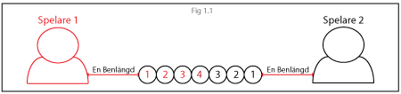

# Appendix – How "PersonCaps" works
A match in personcaps is played as follows. Each player - at match start - recieves four glasses, one of which is shared between the players. In total seven glasses are placed edge-to-edge in a row. The players sit down on opposite ends of the row of glasses, at a distance of their respective legs to their closest glass (as illustrated in fig 1.1). The match then starts with the starting player throwing a bottle cap, with the objective to land it in the furthest out, currently active glass of the opponent (at match start illustrated as 1, in fig 1.1). The match is then turn-based where no matter the outcome of the throw the turn shifts to the other player. If a player lands the bottle cap in the correct glass, that registers as a hit. When a player hits a duel is started, the duel is ended when one of the players miss, the player who missed then loses the duel. After lost duel, the closest glass to the losing player which is still in play should be drunk and turned upside-down to mark it out of play. After lost duel, the one who lost gets to continue the game by throwing a new bottle cap. A round is lost when one of the players have lost four glasses. The player who lost the last round starts the next round. A match usually ends when any player have won two rounds.

### Rules:
* A throw is only valid if the bottle cap is released before the angle (measured at the elbow) exceeds 90°. If the angle is exceeded a warning will be given to the throwing player. If the player already recieved a warning before the throw is considered invalid and the turn shifts.
*
The player who has studied the shortest time at Chalmers gets to begin, if both players began studying the same year the youngest player gets to start.
