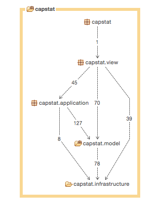
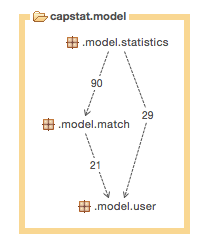
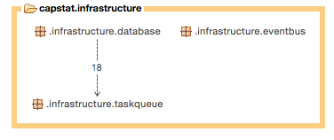
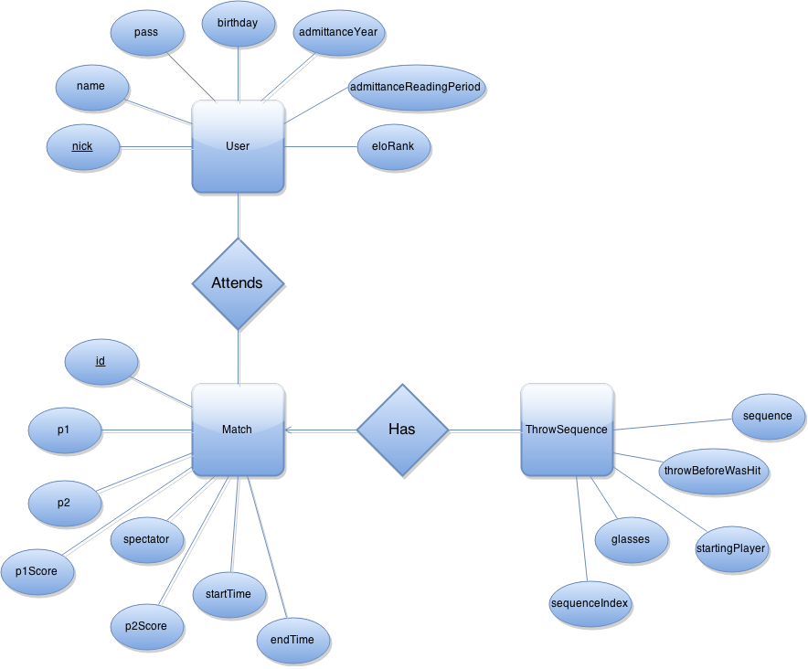
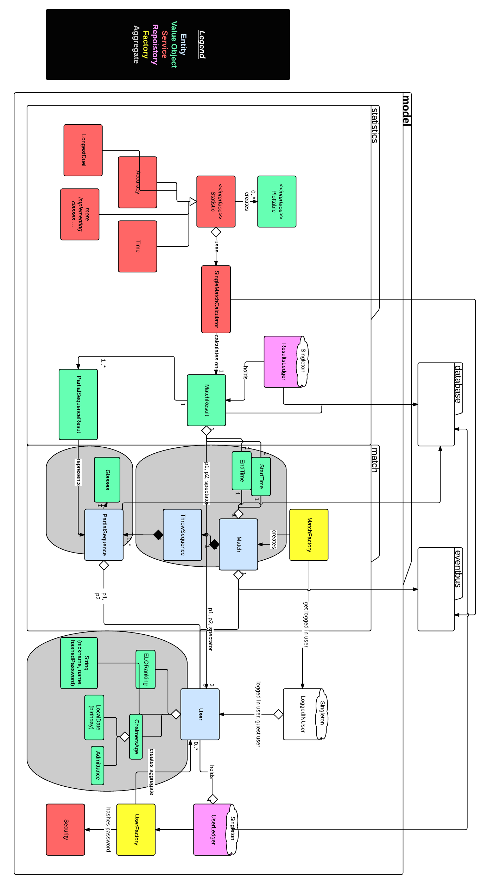
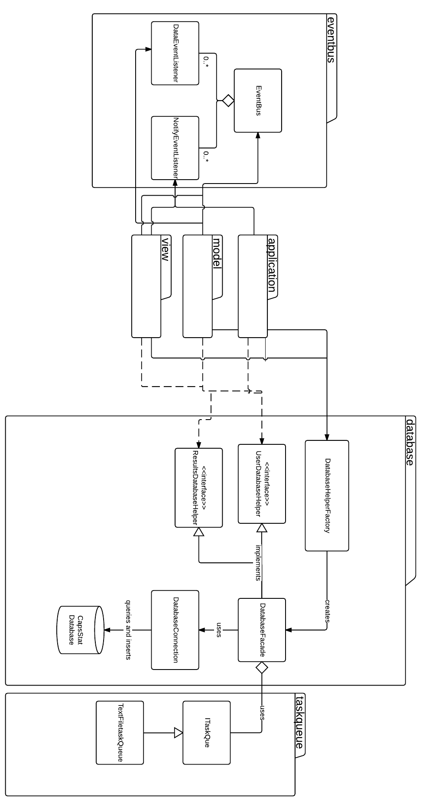
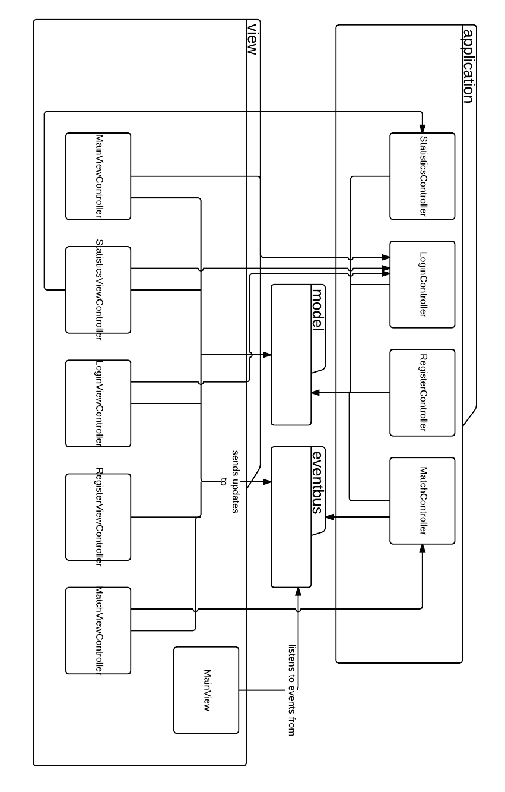

System design document for CapStat (SDD)
=======

###Contents

####1 Introduction

#####1.1 Design goals

#####1.2 Definitions, acronyms and abbreviations

####2 System design

#####2.1 Overview

#####2.2 Software decomposition
######2.2.1 General

######2.2.2 Decomposition into subsystems

######2.2.3 Layering

######2.2.4 Dependency analysis

#####2.3 Concurrency issues

#####2.4 Persistent data management

#####2.5 Access control and security

#####2.6 Boundary conditions

####3 References

####APPENDIX

***

>Version: 0.2

>Date: May 29, 2015

>Author: Johan Andersson, Rikard Hjort, Jakob Holmgren, Christian Persson

This version overrides all previous versions.

###1 Introduction

####1.1 Design goals
The design uses loose coupling between modules to provide the possibility to changes GUI, to move the persistent storage, i.e. to a new remote database or to using a web API. The design should allow users to have great control of the statistics presentation described further down. The design must also be testable, so that unit tests can be written for specific modules. See RAD document for goals regarding usability.

####1.2 Definitions, acronyms and abbreviations
The references section contains definitions and rules for the caps game, which this application is a tool for.

* GUI, graphical user interface.
* JavaFX, a framework for creating a GUI.
* Match, a single match of caps.
* Round, one round in the game, which can consist of several rounds.
* Throw, a single throw in a match, which can be either a hit or miss.
* MVC, a general principle for decoupling responsibilities in the application. See Layered architecture.
* Layered architecture, a way of partitioning the application into four loosely coupled layers used for GUI, controlling the game, representing the domain and handling technical implementations, respectively. For further details see Evans (2004, p. 68-75).
* Business domain, the problem that the application models and for which it provides tools.
* Event bus, an object which handles firing events and adding event listeners in the application.

###2 System design

####2.1 Overview
The project uses the workflow known as Git Flow. In Git Flow, the latest working copy is always the last commit to the master branch. Continuous development is made on the develop branch. Developers check out feature branches from develop on which they work until a feature is done, and then merge back in to develop, using the --no-ff merge option to preserve information about where there have been feature branches. When a new release is about to be made, a release branch is checked out from develop. From this point on, any new work on develop will not be merged in to that release branch, but will have to wait until next release. The release branch is for additional documentation, tests and bugfixes. When a release is done, the branch is merged into master. Fast bugfixes may be made on hotfix branches, which can be made from anywhere.

The application will use layered architecture, which is a modified version of MVC.

The presentation layer will hold the GUI components, which are implemented with the JavaFX framework. The application layer will mainly modify and control the domain layer, the domain layer will model the core domain, and the more technical aspects which the domain layer needs will be handled by the infrastructure layer, which will also take care of event handling through an event bus.

#####2.1.1 The domain model
The model's task is to model the world of caps, where there a matches being played, matches that have been played, and users playing and spectating matches. The model also models the statistics of players, such as their ranking, their accuracy, their wins and losses.

#####2.1.2 Rules
The rules of caps is very well defined, and not likely to change. However, the Match class could be subclassed if different behavior is needed. For a full definition of the rules of caps, see appendix.

#####2.1.3 Matches
A match is played until one player has won as many rounds as is needed. The number is decided at the outset of the match. The outcome of a match, as well as every play of the match, can be recreated at any time as long as the starting player and the full throw sequence is known. However, we have implemented the possibility for a match to have an incomplete throw sequence, without that making the statistics useless

#####2.1.5 Throw sequences
A throw sequence is a series of throws, which are either hits or misses. These are kept by the match they represent, and stored permanently once the game ends. If one has the full, unbroken throw sequence of a match, one could compute anything about the match. But, since the application relies on rapid user input, which could become incorrect at any time, a slightly modified approach to the full, perfect sequence has been chosen. The throw sequence of a match can be split up in several small sequences, each describing the game state at the exact point where it starts. Thus, if something goes wrong, a user can "start over" from a new starting point, while losing minimal amount of information, and without having to discard the whole sequence.  

#####2.1.4 Statistics
The part of the model that handles statistics uses a minimal data input. It uses only the throw sequences, and some simple information about the match. From that information, the statistics can deduce anything that is deducible about a game.

#####2.1.5 Event handling
During a match, a lot of events take place that other parts of a system want to be notified about. Rather than making the Match class handle these publisher-subscriber relations, which might be many, it delegates this work to an event bus. The clients that want to be notified of changes subscribe using the string keys that the Match class provides, and the match notifies the event bus when a change relating to a specific key has taken place. For example, if a client want to get notified when a match ends, it may do so by registering with the event bus using the MATCH_ENDED String constant in match. This approach has the added benefit of being reusable – the event bus can be used for many types of event handling, by any other class. It is strongly recommended that future classes also use the event bus rather than implement another version of the publisher subscriber pattern.

####2.2 Software decomposition
#####2.2.1 General
The software is decomposed into four main modules, or "layers". Two of these have submodules. The modules are ordered hierarchically, meaning that no module may know about another module of higher order. The following list orders modules from higher to lowest. This means that the presentation layer may know about all other layers, while the infrastructure layer may only know about itself. See figure 1 for a diagram of the relationship between layers.

* **Presentation layer**, that handles drawing the GUI and taking user input. This is the view part of the MVC.
* **Application layer**, that handles controlling and modifying the model, and coordinating the model and infrastructure layer. This is the controller part of the MVC.
* **Model layer**, the core object model of the application, representing games of caps, users and handling statistics calculations.
* **Infrastructure layer**, handles low level technical details, such as communicating with the database and managing the task queue that the database uses for intermediate storage. This layer also holds the event bus.

*Figure 1. The relationship between layers. Note that the top layer, called only "capstat", contains only one class, Main, with the single main method that starts the program, and nothing else It is therefore not mentioned int the list of layers.**

#####2.2.2 Decomposition into subsystems
The model layer and the infrastructure layer consists of submodules. The hierarchical philosophy applies here as well: a lower ordered package may not be aware of a higher ordered one. See figures 2 and 3 for a diagram of relationships between packages.

The model layer consists of the following subsystems:
* **Statistics package** contains a class for representing a match that has been played and saved, a repository for storing and saving matches, and means of creating plottable statistics for played games.
* **Match package**, the module that contains the match factory, matches and the throw sequences. This submodule represents the "live" match, that can be played and listened to by observers.
* **User package** contains elements of the User aggregate, means to create it, a class for keeping track of and setting which user is currently logged in, and a repository for storing and retrieving users.

*Figure 2. The relationship between submodules in the model layer.*

The infrastructure layer consists of the following subsystems:
* **Database package**, manages connection to the database, both modifying and querying. This package contains value objects, called "blueprints", representing what can be stored to or fetched from the database.
* **Taskqueue package**, handles local intermittent storage while objects are added to the database, to prevent dataloss.
* **Eventbus package**, contains the event bus and the interfaces that listeners need to implement to register with it.

*Figure 3. The relationships between subsystems in the infrastructure layer.*

#####2.2.3 Layering
The layering follows the pattern of the modules described under 2.2.1. Figure 1 describes this layering. Higher ordered layers are higher in the figure.

#####2.2.4 Dependency analysis
There are no circular dependencies between modules, except for between the Match and ThrowSequences classes, which are very tightly coupled. For a dependency analysis, see figures 1, 2 and 3. For a more detailed analysis, see the images in the UML directory.

####2.3 Concurrency issues
The program is run by a single thread, with one exception: before sending post requests to the database, the requests are stored in full locally, and a separate thread is started to send these to the database. This is to ensure no data is lost if the connection to the database is lost, e.g. if it is on a remote server and there is not internet access.

This means that if a client asks the database subsystem to save a user or as result, and immediately tries to retrieve it, it might not yet have been saved to the database and might not be retrieved. During normal use this is not an issue, since there is no reason to fetch immediately after storing, but it means that some unit tests, which do just that, may have to wait for the process to finish.

####2.4 Persistent data management
All persistent data will be stored in a MySQL database hosted locally. (However, the use of a facade and a separate class for database connection the database package means this may be migrated fairly easily). The database consists of four tables. For a diagram over the database, see figure 4. The four tables are:
* **Users** which holds a user's nickname, full name, a hashed version of the user's password, their birthday, their admittance year, the reading period of their admittance, and their current ELO ranking.
* **Matches** which holds match results, stored with a unique id, the nickname of both players, the nickname of the user who registered the game, the final scores of both players, the start time of the match and the end time (as seconds elapsed since 00:00 AM, January 1, 1970).
* **ThrowSequences** which holds all registered throw sequences, divided into partial sequences. Every sequence has a match id and an index of it's order in all the sequences of the match, since one match may have several. A sequence also stores the state of the glasses when it begun, which player's turn it was, whether the last throw was a hit or miss (which is needed to see if the game was in a duel or not) and the sequence of hits and misses that the partial sequence represents.
* **Attends** is a relation between the Users table and Matches table, which is used to indicate which player attended a certain match.

*Figure 4. Diagram over the database*

####2.5 Access control and security
The database for persistent storage is hosted locally, and requires that the user is on localhost to connect to. In addition to this, it has a password. However, this password is shown in plain text in the source code, and thus not very secret. Even a closed-source distribution would not be secure, since it would be easy to decompile the code and get access to both the username and password needed to access the database. Therefore, the application in its current form could not point to a shared, remotely hosted database in a way that would be safe. To address this problem and ensure that CapStat could use a shared database for all users running the program in the future, all connections to the database are made through a Facade (Gamma, Helm, Johnson and Vlissides, 1995, p. 185-194). If the persistent storage would be migrated to a more secure implementation, e.g. a web API, only this class would need to change. Therefore, CapStat has been written in preparation for a future migration to a public, safe persistent storage.

####2.6 Boundary conditions
For CapStat to compile and run, a local MySQL database must first be created. This is done using the steps described in the README file. Most of the setup process is handled by a .sql-file, but the initial setup requires the user to execute a set of commands as root user for the database.

###3 References
1. [Git Flow](  http://nvie.com/posts/a-successful-git-branching-model/)
1. Layered Architecture: Evans, E. (2004). Domain-Driven Design: Tackling Complexity in the Heart of Software. Prentice Hall.
2. Design patterns: Gamma, E., Helm, R., Johnson, R. och Vlissides, J. (1995). Design Patterns: Elements of Reusable Object-Oriented Software. Addison-Wesley.
3. [UML diagrams over packages](./UML).
4. [Rules of caps](./Documents/rulesofCaps.md)

###APPENDIX

####Class diagrams for the packages
#####The model layer and its submodules

* **User package**
  * *User* is the root of an aggregate representing a user in the system. The user has a number of value objects, such as name and password, which are represented as strings. The User aggregate also has three value objects created specially for this project:
    * *ELORanking* holds a double value, and methods for calculating new rankings depending on the outcomes of a match.
    * *ChalmersAge* is an age measurement specific to caps. A players age is determined primarily by how long they have been studying at Chalmers, and secondarily by how old they actually are.
    * *Admittance* is the object holding a user's time of admittance to Chalmers.  
  * *UserFactory* can create new user, the Guest user, and a few dummy users used for testing.
  * *Security* is a service for hashing passwords.
  * *UserLedger* is a repository for users, helping with persistent storage and retrievals of user. It holds references to all users that have been used during a session for quick access, and can also fetch users from the database.
  * *LoggedInUser* holds a reference to the currently logged in user, and means for changing what user is logged in.

* **Match package**
  * *Match* represents a match of caps, and actions that can be taken on it.
  * *Glass* represents a glass in the game, and is an inner class of Match.
  * *ThrowSequence* represents all the recorded throws in a match. It is made up of one or more PartialSequences.
    * *PartialSequence* is an inner class of  ThrowSequence and holds the state of a game at a certain moment, and every recorded throw that followed. It is the basis of calculating statistics for a game. Since it used often by the statistics package, it is the root of its own aggregate.
  * *MatchFactory* can be used to create a new matches. It also sets the correct starting player, when possible.

* **Statistics package**
  * *ResultsLedger* is a repository for storing finished matches, which can the be retrieved as MatchResults.
  * *MatchResult* is a value object representing the outcome of a match.
  * *PartialSequence* is a value object representing a partial sequence.
  * *SingleMatchCalculator* is a service that takes a match result and can be queried on some different facts about the match such as the accuracy, longest duel length, etc.
  * *Plottable* is an interface for getting objects that have a double value, which could be used for plotting, and a string value, which could be used as a label for the plot point.
  * *Statistic* is an interface for using the Strategy pattern. The implementing classes calculate different statistics by taking an ordered list of matches and returning a list of plottables representing an aspect of the match, in the same order.

#####The infrastructure layer and its submodules

* **Taskqueue package**
  * ITaskQueue is an interface for storing tasks (represented by strings) persistently.
  * *TextFileTaskQueue* implements ITaskQueue by saving the strings to a text file.

* **Database package**
  * **UserDatabaseHelper** and **ResultDatabaseHelper** are the public interface toward the database.
  * **DatabaseHelperFactory** creates objects that implement the interfaces above.
  * **DatabaseFacade** implements the interfaces, and handles saving and retrieving. This facade can be rewritten to use another database, a web API, or text files, to name a few modes of persistent storage. The rest of the application thue becomes very loosely coupled to the actual mode of persistent storage.
  * **DatabaseConnection** uses the JDBC and JOOQ frameworks to talk to the MySQL database.
  * *CapStat Database* is a local MySQL database.
* **Eventbus package**
  * *EventBus* handles events by letting clients register to events with strings as keys.
  * *DataEventListener* is an interface which listeners implement to get events that send data.
  * *NotifyEventListener* is an interface that listeners implement to get dataless events.

#####The view and application layers

* **Application layer**
  * *StatisticsController* helps creating plottables from sets of matches.
  * *LoginController* helps verify login in credentials and log users in.
  * *RegisterController* helps with registering new users.
  * *MathController* helps playing matches and performing appropriate tasks afterwards, like saving matches and updating rankings.
* **View layer**
  * *TopWindow* is the main window, and the JavaFX Application. It listens to the event bus to set its scenes.
  * *MainViewController* represents the main panel in the application, where the user goes either to the statistics view or to the view for recording a match.
  * *StatisticsController, LoginViewController, RegisterViewController* and *MatchViewController* controls their respective views.
